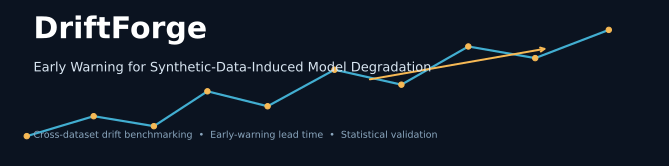
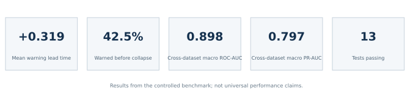
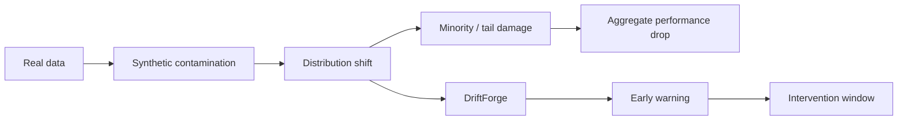
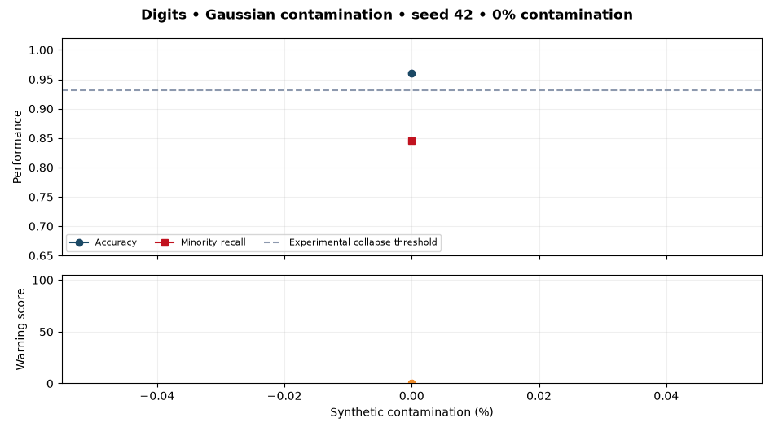
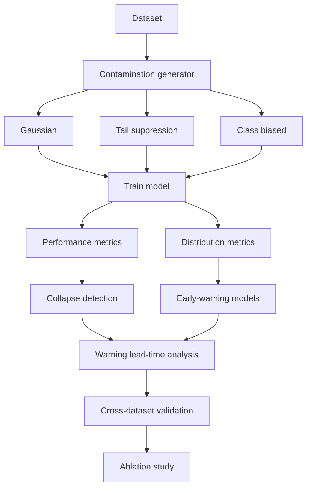
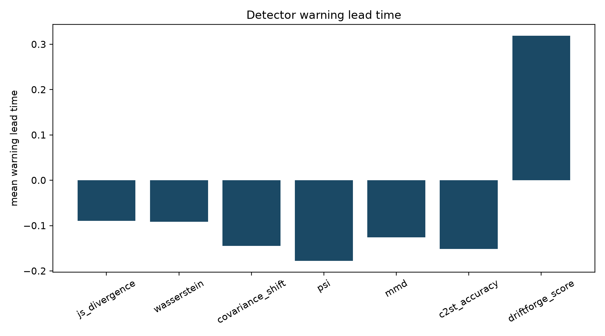
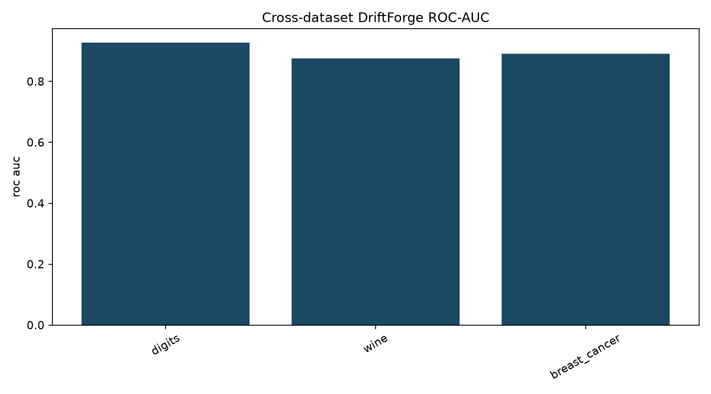
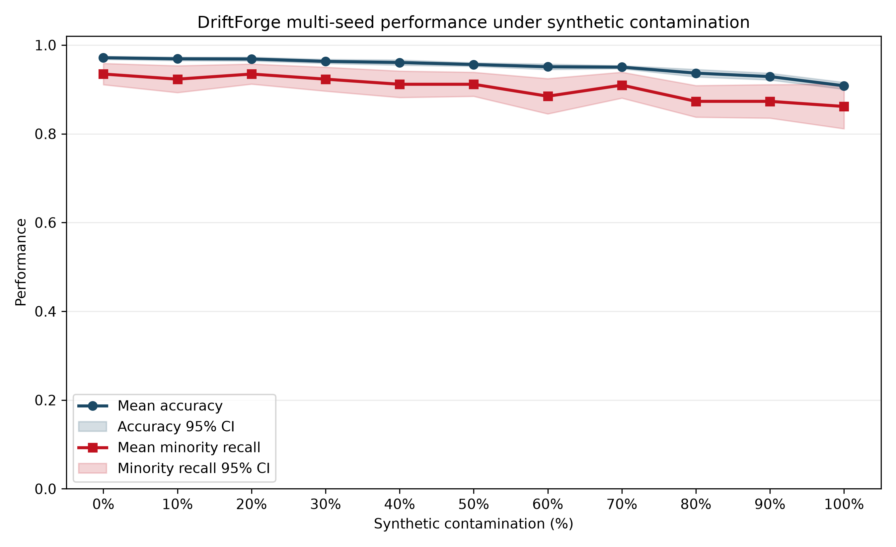
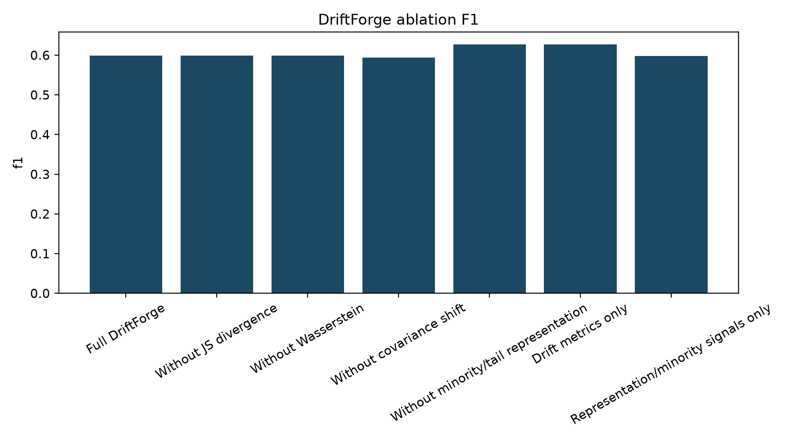
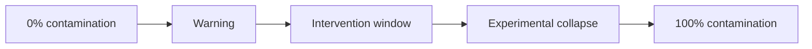

<p align="center">
  
</p>

<p align="center">
  
  
  
  
  
  
  
  
  
</p>

Modern model monitoring usually asks whether a system has already drifted. DriftForge asks a different question: can we detect degradation early enough to act before aggregate performance visibly fails?

<p align="center">
  
</p>

## Why DriftForge?



Traditional monitoring: **detect failure**. DriftForge: **estimate warning before failure**.

## Research Question

> Can dataset-level statistical signals reveal synthetic-data-induced model degradation before aggregate model accuracy substantially deteriorates?

## Key Finding

> JS divergence was the better conventional degradation discriminator. DriftForge was the only evaluated detector with positive mean warning lead time in this controlled benchmark.

| Method | ROC-AUC | Mean warning lead time | Warned before collapse |
|---|---:|---:|---:|
| JS divergence | 0.907 | -0.089 | 17.5% |
| Wasserstein | 0.891 | -0.092 | 17.5% |
| DriftForge | 0.831 | **+0.319** | **42.5%** |

This is not a claim that DriftForge universally outperforms JS divergence. It highlights an experimentally observed tradeoff between conventional discrimination and warning timing.

## See Drift Happen

<p align="center">
  
</p>

*Representative existing run: Digits dataset, Gaussian contamination, seed 42. Values are read directly from `results/benchmark/benchmark_results.csv`; the dashed line is the project-defined 3-percentage-point accuracy-drop threshold.*

## Benchmark at a Glance

| | | | |
|---:|:---:|:---:|:---:|
| **3** datasets | × | **3** mechanisms | × |
| **5** seeds | × | **11** contamination levels | = |
| | | | **495 controlled conditions** |

**Datasets:** Digits, Wine, Breast Cancer

**Contamination:** Gaussian, tail suppression, class biased
**Baselines:** Jensen-Shannon divergence, Wasserstein distance, covariance shift, PSI, MMD, C2ST

## Experimental Pipeline



## Results

### Early-Warning Lead Time

<p align="center">
  
</p>

Positive lead time means the first warning occurs before the first observed collapse. Negative values mean the detector’s threshold was reached after collapse.

### Cross-Dataset Generalization

<table>
  <tr>
    <td width="50%"></td>
    <td width="50%"></td>
  </tr>
</table>

Cross-dataset macro ROC-AUC was **0.898** and macro PR-AUC was **0.797**. The Digits false-positive rate was **0.839**, so threshold transfer was materially unstable.

### Ablation Study

<p align="center">
  
</p>

Removing covariance shift improved ROC-AUC/PR-AUC, while drift-only features improved F1. **More signals does not automatically mean better early warning.**

## Why Warning Lead Time Matters



`warning_lead_time = collapse_point - first_warning_point`
Positive lead time means a warning occurs before observed collapse.

## Cross-Dataset Validation

| Held-out dataset | ROC-AUC | PR-AUC | F1 | FPR |
|---|---:|---:|---:|---:|
| Digits | 0.927 | 0.875 | 0.594 | 0.839 |
| Wine | 0.876 | 0.812 | 0.651 | 0.051 |
| Breast Cancer | 0.891 | 0.705 | 0.552 | 0.143 |
| **Macro** | **0.898** | **0.797** | **0.599** | **0.344** |

## Quick Start

```bash
git clone https://github.com/Nikita3005/DriftForge.git
cd DriftForge
python -m venv .venv
```

Windows:

```powershell
.venv\Scripts\Activate.ps1
```

macOS/Linux:

```bash
source .venv/bin/activate
```

```bash
pip install -r requirements.txt
python experiments/run_experiment.py
python -m pytest -q
```

```bash
# Multi-seed experiment
python experiments/run_multiseed.py

# Full benchmark: slower, regenerates benchmark artifacts
python experiments/run_benchmark.py
```

## Repository Architecture

```text
DriftForge/
├── driftforge/
│   ├── benchmark.py
│   ├── datasets.py
│   ├── detectors.py
│   ├── metrics.py
│   ├── scoring.py
│   └── synthetic.py
├── experiments/
│   ├── run_experiment.py
│   ├── run_multiseed.py
│   └── run_benchmark.py
├── results/
│   └── benchmark/
├── assets/
│   └── readme/
├── scripts/generate_readme_assets.py
├── tests/
├── TECHNICAL_REPORT.md
├── CITATION.cff
└── README.md
```

<details>
<summary><b>Scientific limitations</b></summary>

- The benchmark uses three relatively small scikit-learn datasets.
- Contamination mechanisms are controlled proxies, not real generative-model deployment data.
- Results use five benchmark seeds and a reduced-tree benchmark model.
- The 3-percentage-point collapse threshold is experimental and project-specific.
- Threshold transfer was unstable, including a high Digits FPR of 0.839.
- Correlation is not causation; this is cross-dataset, not cross-domain, validation.
- No real-world generative-model contamination has been evaluated yet.

</details>

## Technical Report

> [Read the full methodology, benchmark design, ablations, and limitations →](TECHNICAL_REPORT.md)

Generated data tables: [detector comparison](results/benchmark/detector_comparison.csv), [cross-dataset validation](results/benchmark/leave_one_dataset_out.csv), and [ablation results](results/benchmark/ablation_results.csv).

## Reproducibility

**13 tests passing**. The project uses deterministic explicit random seeds; the GitHub Actions badge above tracks the test workflow.

## Citation

Use the repository’s [CITATION.cff](CITATION.cff) when citing this software artifact. No DOI or publication is claimed.

## Future Research

- Real generative-model contamination
- Larger real-world datasets
- Adaptive threshold calibration
- Warning-lead-time optimization
- Temporal contamination streams

## Author

Nikita Gajbhiye · [GitHub](https://github.com/Nikita3005)
